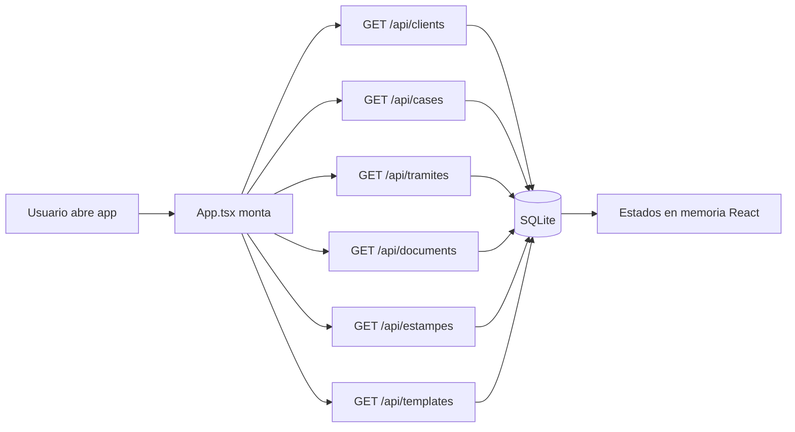
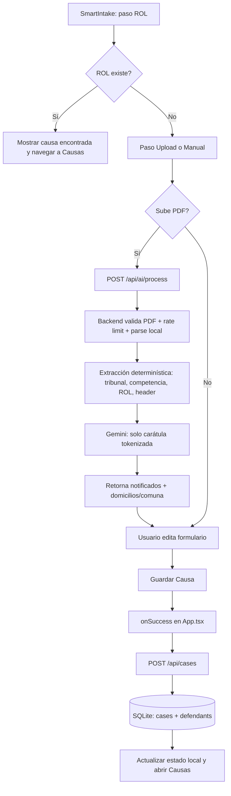
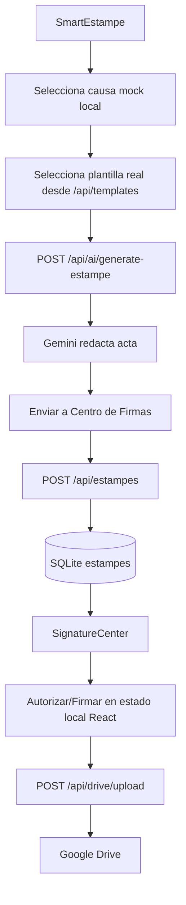

# Flujo Actual de Stamply (estado del código)

## 1) Arquitectura actual

- `Frontend`: React (`src/*`) con navegación por tabs en `App.tsx`.
- `Backend`: Express + Vite middleware en `server.ts`.
- `Persistencia`: SQLite local (`stamply.db`) mediante `src/db/index.ts`.
- `IA`: Gemini (`/api/ai/process` y `/api/ai/generate-estampe`).
- `Integración externa`: Google OAuth + Google Drive (`/api/auth/*`, `/api/drive/upload`).

## 2) Flujo de arranque

## 3) Flujo principal: ingreso de causa

## 4) Flujo estampe y firmas

## 5) Flujo de trámites y cobranza

- `Trámites`:
  - Alta: `POST /api/tramites`.
  - Edición: `PUT /api/tramites/:id`.
  - Eliminación: `DELETE /api/tramites/:id`.
- `Cobranza`:
  - Usa datos mock para facturación general.
  - En pestaña “Trámites” marca `facturado=true` vía `PUT /api/tramites/:id`.

## 6) Endpoints activos hoy

- Auth/Drive:
  - `GET /api/auth/url`
  - `GET /auth/callback`
  - `GET /api/auth/status`
  - `POST /api/auth/disconnect`
  - `POST /api/drive/upload`
- IA:
  - `POST /api/ai/process`
  - `POST /api/ai/generate-estampe`
  - `POST /api/ai/clear-cache`
- CRUD parcial:
  - Clientes: `GET/POST/PUT/DELETE`
  - Causas: `GET/POST/PUT` (sin `DELETE`)
  - Trámites: `GET/POST/PUT/DELETE`
  - Documentos: `GET/POST` (sin `DELETE`)
  - Estampes: `GET/POST/PUT`
  - Plantillas: `GET/POST/PUT/DELETE`

## 7) Brechas del flujo actual (importantes)

- [x] La UI intenta borrar causas con `DELETE /api/cases/:id`, pero ese endpoint no existe. (RESUELTO)
- [x] La UI intenta borrar documentos con `DELETE /api/documents/:id`, pero ese endpoint no existe. (RESUELTO)
- [x] En `TemplateLibrary`, al editar plantilla se espera que `PUT /api/templates/:id` devuelva la plantilla; el backend responde `{ ok: true }`. (RESUELTO)
- [x] `SmartEstampe` usa causas mock (`CASES_FOR_ESTAMPE`) en vez de `cases` reales. (RESUELTO)
- `SignatureCenter` cambia estados de estampe y documentos en memoria local, sin persistir esos cambios en API/DB.
- [x] En `SmartIntake`, crear cliente/cartera desde el modal solo actualiza estado local (no persiste en `/api/clients`). (RESUELTO)

## 8) Estado resumido

El flujo operativo central **sí funciona** para:
- Cargar datos base desde SQLite.
- Crear causas (con o sin IA).
- Crear/editar trámites.
- Generar estampes con IA y guardarlos.

El flujo aún está **híbrido (persistente + mock/local)** en:
- Estampe (selección de causa),
- Firmas/documentos (cambios en memoria),
- Eliminaciones de causas/documentos,
- Edición de plantillas (respuesta inconsistente en `PUT`).

